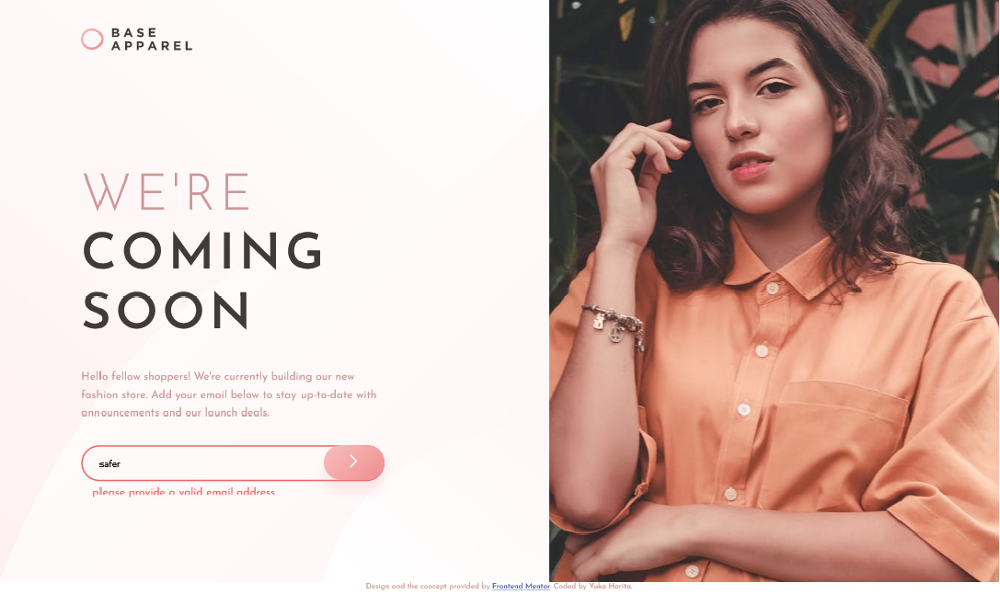
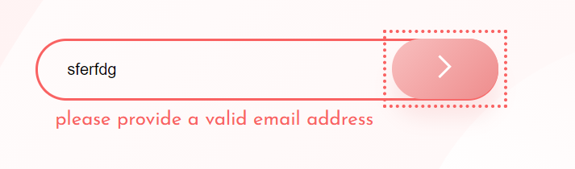
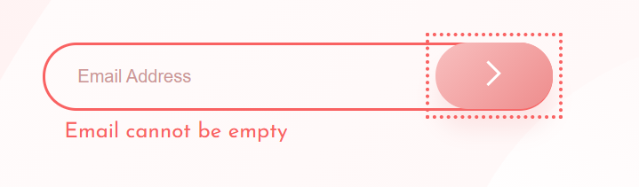

# Frontend Mentor - Base Apparel coming soon page solution

This is a solution to the [Base Apparel coming soon page challenge on Frontend Mentor](https://www.frontendmentor.io/challenges/base-apparel-coming-soon-page-5d46b47f8db8a7063f9331a0). Frontend Mentor challenges help you improve your coding skills by building realistic projects.

## Table of contents

- [Overview](#overview)
  - [The challenge](#the-challenge)
  - [Screenshot](#screenshot)
  - [Links](#links)
- [My process](#my-process)
  - [Built with](#built-with)
  - [What I learned](#what-i-learned)
  - [Continued development](#continued-development)
  - [Useful resources](#useful-resources)
- [Author](#author)

## Overview

This is to practice HTML semantics, CSS and custom form input validation by JavaScript.

### The challenge

Users should be able to:

- View the optimal layout for the site depending on their device's screen size
- See hover states for all interactive elements on the page
- Receive an error message when the `form` is submitted if:
  - The `input` field is empty
  - The email address is not formatted correctly

### Screenshot

- Desktop View at 1440px

  

- Mobile View at 375px

  

- Desktop View with an error message

  

- Error Message for Invalid Email Address

  

- Error Message for Empty Field

  

- Error Message for Valid Email Input

  

### Links

- Solution URL: [Frontend Mentor](https://www.frontendmentor.io/solutions/email-register-website-with-validation-ZnJ0EgwQc)
- Live Site URL: [Vercel](https://base-apparel-nu.vercel.app/)

## My process

- Positioned hero image in the different order at the mobile and desktop view by using CSS Grid.
- Achieved accessibility for error messages.
- Error message is altered depending on the errors that the user get.
- All interactive elements are focusable.
- Customised email validation in JavaScript file.
- Put effect with linear-gradient on background-image.

### Built with

- Semantic HTML5 markup
- CSS custom properties
- Flexbox
- CSS Grid
- Mobile-first workflow
- JavaScript

### What I learned

It was a bit hard to position hero image for both desktop and mobile view. I have used CSS Grid to achieve that.

I learnt how the error message can be accessible by screen readers. I markuped HTML as follows;

```html
<form action="#" class="main__form" novalidate>
  <div class="main__form--input-container">
    <input
      type="email"
      name="email"
      id="email"
      aria-label="Type Your Email"
      required
      aria-live="assertive"
      placeholder="Email Address"
      class="main__form--input"
      aria-describedby="error-message"
    />
    
    <button type="submit" aria-label="Submit your email" class="btn-submit">
      
    </button>
  </div>
  <p
    class="main__form--error-message"
    role="alert"
    aria-atomic="true"
    id="error-message"
  ></p>
</form>
```

I also put effort to cusomize the email validation in JS.

### Continued development

I could have done the different way to position hero images by making desktop size image as background image. The viewheight should be 100vh when I see them in desktop.

### Useful resources

- [W3C ARIA の達成方法(in Japanese language)](https://waic.jp/docs/WCAG-TECHS/aria.htmlm) - This helped me how to markup HTML of error message and input field to acheive accessiblity.
- [WAI-ARIA basics](https://developer.mozilla.org/ja/docs/Learn/Accessibility/WAI-ARIA_basics)

## Author

- Frontend Mentor - [@sloth247](https://www.frontendmentor.io/profile/Sloth247)
